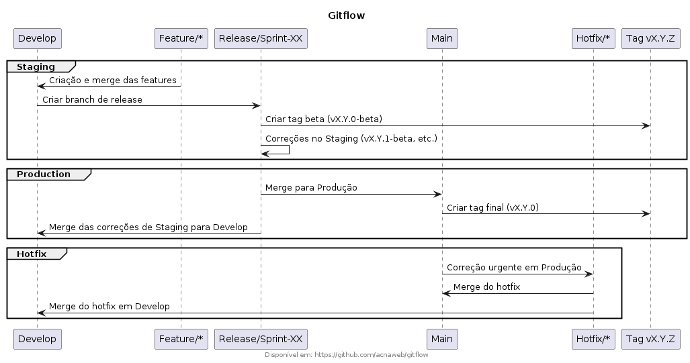

# Gitflow

Continuous integration and continuous deployment using Gitflow.

## O Gitflow



#### 1. Estrutura de Branches

A estrutura de branches do fluxo Gitflow pode ser organizada da seguinte forma:

- **`develop`**: Branch principal para o desenvolvimento contínuo.
- **`feature/*`**: Branches para cada nova feature, originadas de `develop`.
- **`release/*`**: Criadas ao final de cada sprint para preparar o ambiente de staging.
- **`hotfix/*`**: Para correções urgentes em produção.
- **`main`**: Branch de produção, onde as versões finais são implantadas.

#### 2. Fluxo para Versionamento

O fluxo de versionamento no Gitflow pode ser descrito da seguinte maneira:

1. Cada **feature** é desenvolvida em uma branch `feature/*` a partir de `develop`.
2. Ao final da sprint, todas as features são mescladas na branch `release/sprint-XX`.
3. Para o ambiente de **staging**, cria-se a tag **`vX.Y.0-beta`**.
4. Se houver **correções** em staging, são realizadas dentro da branch `release/sprint-XX` e podem receber tags incrementais, como **`vX.Y.1-beta`**.
5. Quando aprovado, a branch `release/sprint-XX` é mesclada na `main` e recebe a tag **`vX.Y.0`** para produção.
6. As **correções** do ambiente de staging são mescladas de volta para `develop` para manter a consistência.

#### 3. Correções em Produção (Hotfixes)

Se houver uma correção urgente em produção, a estratégia é:

1. Criar uma **branch `hotfix/*`** a partir de `main` para corrigir problemas críticos.
2. Após realizar a correção, a branch `hotfix/*` é mesclada tanto em `main` quanto em `develop`, garantindo que a correção seja aplicada nas versões futuras.

#### Resumo do Versionamento

- **`vX.Y.0-beta`**: Versão de **staging** para testes.
- **`vX.Y.1-beta`**: Correções incrementais no **staging**.
- **`vX.Y.0`**: **Versão final** para produção.
- **`hotfix/vX.Y.Z`**: Correções urgentes em produção.

## Setup do Repositório

- secrets.REPOSITORY_TOKEN 

## Releases/Tags

#### Gerando uma Release via Git CLI

```sh
# Criar uma tag localmente
git tag -a v0.1.10 -m "Setup CD" 

# Enviar a tag para o repositório
git push origin v0.1.10
```

#### Listar tags

```sh
git tag
```

#### Exibir detalhes da tag

```sh
git show v0.1.1
```
